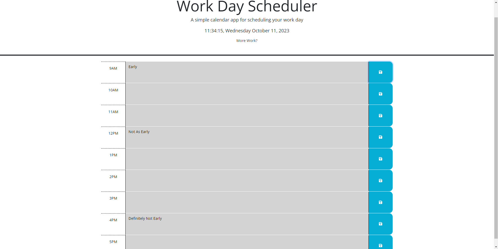

# A Calendar For All Time 

In this activity, the goal is to have a simple calendar that can also schedule activities on the hour throughout the day, as each day passes. There needs to be a save button that displays a message showing that the file is saved in some way once you've saved your work activity. The time range for the calendar needs to go through 9 AM to 5 PM, a typical workday. The colors of the rows need to change depending on if it's the current hour (red), if it's a past hour (gray), or if it's a future hour (green).

## Knowledge

This activity required a lot of usage of jquery in order to obtain information, and help separate the various parts of the website. Things like time, save features, and local storage need to be kept in mind while doing this. Overall, this project was enjoyable, while also being challenging.

## Here's what we've got.

A link to the github portfolio repository: [https://github.com/cddoigkn/schedule-calendar](https://github.com/cddoigkn/schedule-calendar)

A link to the quiz website: [https://cddoigkn.github.io/schedule-calendar](https://cddoigkn.github.io/schedule-calendar)

